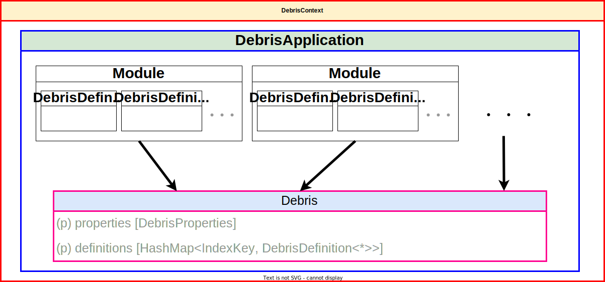
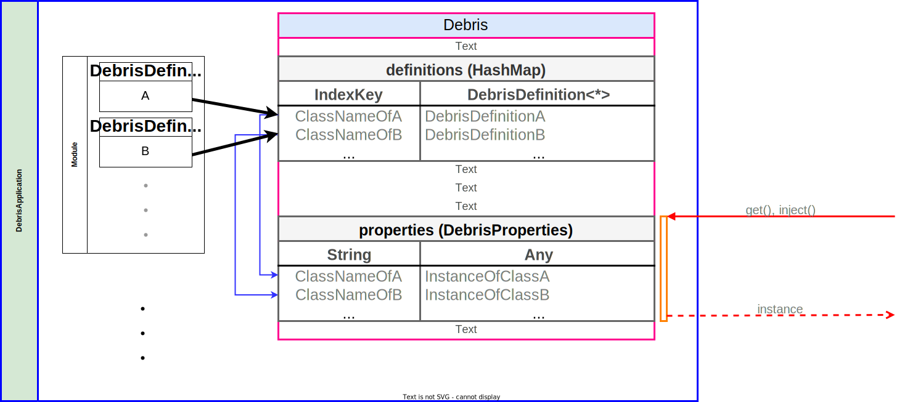
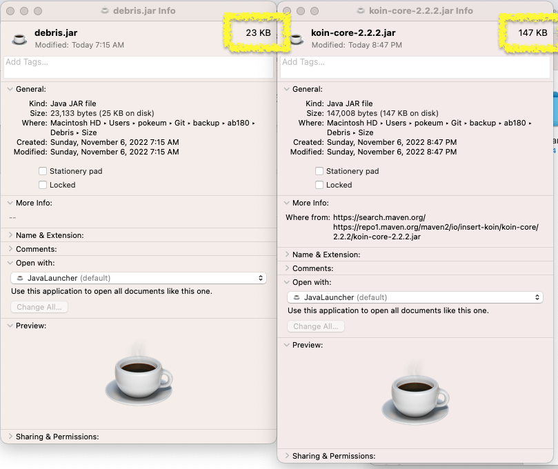
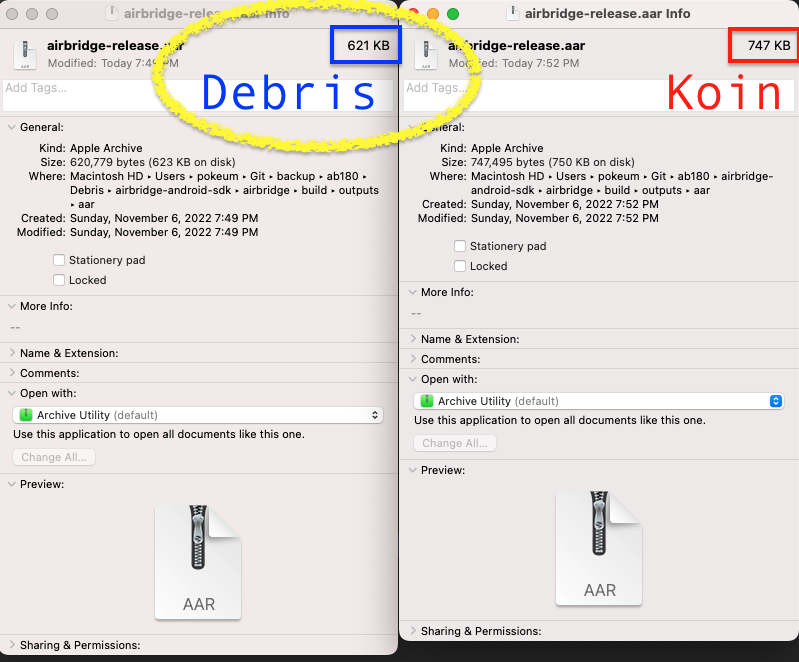

# Debris

Debris is `light-weight` Kotlin dependency injection library.    
Simplified `Koin`

* [Koin (Git)](https://github.com/InsertKoinIO/koin)
* [Koin (Official-Site)](https://insert-koin.io/)

```
Copyright 2017 Arnaud GIULIANI, Laurent BARESSE

Licensed under the Apache License, Version 2.0 (the "License");
you may not use this file except in compliance with the License.
You may obtain a copy of the License at

    http://www.apache.org/licenses/LICENSE-2.0

Unless required by applicable law or agreed to in writing, software
distributed under the License is distributed on an "AS IS" BASIS,
WITHOUT WARRANTIES OR CONDITIONS OF ANY KIND, either express or implied.
See the License for the specific language governing permissions and
limitations under the License.
```

**Strongly recommend to use Koin instead of Debris**

> **Note**
> * Debris does not support Dynamic Modules. (e.g. loadModules, unloadModules)
> * Debris does not support Context Isolation. (**Support `Global Context` Only**)
> * Debris does not support Scope.

## Table of content

- [Structure](#structure)
- [Domain-specific language](#dsl)
- [Getting started](#getting-started)
- [Documentation](#documentation)
  - [Start Debris](#start-debris)
  - [Debris Component (Java)](#debris-component)
  - [Resolving instance from Debris](#resolving-instance-from-debris)
  - [Passing Parameters - Injected Parameters](#passing-parameters)
  - [Injecting in Tests](#injecting-in-tests)
- [Benefits of using Debris](#benefits)
- [Thanks](#thanks)

## <a id="structure"> Structure



> **Note**<br/>
> **`DebrisContext` is Global Context**

### How User Interface Works?



## <a id="dsl"> Domain-specific language



```kotlin
startDebris {               // this: DebrisApplication
    module {                // this: Module
        single {            // this: Debris
            SomeClass()
        }
    }
}
```

## <a id="getting-started"> Getting started

## <a id="documentation"> Documentation

* ## <a id="start-debris"> Start Debris

    ### The startDebris function
    The startDebris function is the main entry point to launch Debris container. It needs a list of Debris modules to run.
    Modules are loaded and definitions are ready to be resolved by the Debris container
    > **Warning**<br/>
    > **The `modules` function needs to called only once inside of the startDebris function**

    ```kotlin
    // start a DebrisApplication in Debris(Global) context
    startDebris {
        // declare used modules
        modules(airbridgeModule)
    }
    ```

    #### <!-- The debrisApplication function (Not Recommended) -->
    <details>
    <summary><b>The debrisApplication function (Not Recommended)</b></summary>

    ```kotlin
    // declare a DebrisApplication
    val debrisApplication = debrisApplication {
        // declare used modules
        modules(airbridgeModule)
    }
    // start a DebrisApplication in Debris(Global) context
    DebrisContext.register(debrisApplication)
    ```

    </details>

* ## <a id="debris-component"> Debris Component (Java)

    Debris components helps to retrieve our instances outside of the container. Let's take an example.
    
    A module to define Deeplinker instance

    ```kotlin
    class Deeplinker

    val airbridgeModule = module {
        // Define a singleton for Deeplinker
        single { Deeplinker() }
    }
    ```

    we start Debris before using definition.
        
    Start Debris with airbridgeModule

    ```kotlin
    fun init(app: Application, config: AirbridgeConfig) {
        // Start Debris
        startDebris {
            modules(airbridgeModule)
        }

        // Create Tracker instance and inject from Debris container
        Tracker()
    }
    ```
  
    Here is how we can write our Tracker to retrieve instances from Debris container.
        
    Use `get()` & `by inject()` to inject Deeplinker instance

    ```kotlin
    class Tracker {

        // lazy inject Debris instance
        private val deeplinker by inject(Deeplinker::class.java)

        // or
        // eager inject Debris instance
        private val deeplinker = get(Deeplinker::class.java)
    }
    ```

* ## <a id="resolving-instance-from-debris"> Resolving instance from Debris

    ```kotlin
    // declare a Debris and start Debris
    val debris: Debris = startDebris {
        val airbridgeModule = module {
            single { TrackerImpl() as Tracker }
        }
        modules(airbridgeModule)
    }.debris
  
    // retrieve instance from Debris
    debris.get<Tracker>().startTracking()
    ```

* ## <a id="passing-parameters"> Passing Parameters - Injected Parameters

    Just use the usual `get()` function

    ```kotlin
    class DeviceInfoImpl(
        private val context: Context
    ) : DeviceInfo { }
    
    // Start Debris
    startDebris {
        val androidModule = module {
            single { app }
            single { app as Context }
        }
        val scrapperModule = module {
            single { DeviceInfoImpl(get()) as DeviceInfo }
        }
        modules(androidModule, scrapperModule)
    }
    ```

* ## <a id="injecting-in-tests"> Injecting in Tests

    ```kotlin
    class SomeTest {

        @Before
        fun setUp() {
            // Start Debris
            startDebris {
                val airbridgeModule = module {
                    single { Deeplinker() }
                    single { MockEventHandler() as EventHandler }
                    single { TrackerImpl() as Tracker }
                }
                modules(airbridgeModule)
            }
        }

        @After
        fun tearDown() {
            // Stop Debris
            stopDebris()
        }

        @Test
        fun testCaseA() { /* testing case A */ }

        @Test
        fun testCaseB() { /* testing case B */ }
    }
    ```

## <a id="benefits"> Benefits of using Debris

<table>
  <tr>
    <td>3rd party library size</td>
    <td>Airbridge SDK size</td>
  </tr>
  <tr>
    <td></td>
    <td></td>
  </tr>
 </table>

:coffee: [io.insert-koin:koin-core:2.2.2](https://search.maven.org/search?q=g:io.insert-koin%20AND%20a:koin-core%20AND%20v:2.2.2)

## <a id="thanks"> Thanks
* [Koin](https://github.com/InsertKoinIO/koin)
* [@Sangryel](https://github.com/Sangryel)'s Debris
